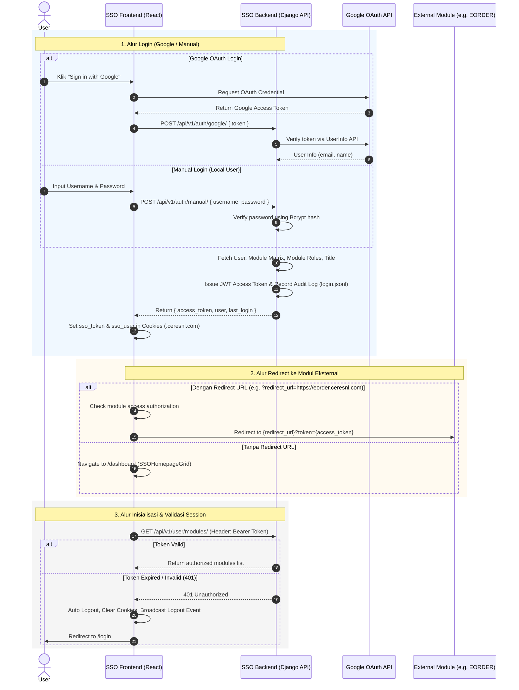

# Dokumentasi Flow & API Reference - Project SSO (Single Sign-On)

Dokumen ini berisi penjelasan lengkap mengenai alur kerja (flow) arsitektur sistem dan spesifikasi pemanggilan API pada project **SSO (Single Sign-On)**.

---

## 1. Arsitektur & Gambaran Umum

Project SSO terdiri dari 2 komponen utama:
1. **SSO Frontend (`sso_frontend`)**: Aplikasi berbasis React + TypeScript + Vite + React Router + Tailwind CSS.
2. **SSO Backend (`sso_backend`)**: API Server berbasis Django + Django REST Framework (DRF) yang menerbitkan dan memverifikasi JWT (JSON Web Token), mengelola otorisasi modul, mengintegrasikan Google OAuth, serta mencatat log audit aktivitas login secara konsisten.

---

## 2. Alur Kerja Sistem (System Flows)



---

### Detail Alur Kerja Utama

#### A. Alur Autentikasi (Login Flow)
1. **Google OAuth Login**:
   - User menekan tombol "Sign in with Google" yang di-render oleh `@react-oauth/google`.
   - Diterima access token dari Google OAuth.
   - Frontend memanggil API `POST /api/v1/auth/google/`.
   - Backend memvalidasi token ke endpoint Google `https://www.googleapis.com/oauth2/v3/userinfo`.
   - Backend mengambil data hak akses modul dari tabel `ModuleMatrix`, peran modul dari `UserModuleRole`, dan jabatan dari `TitleMatrix`.
   - Backend menerbitkan **JWT Access Token** dan mencatat audit log sukses ke file `logs/login.jsonl`.
2. **Manual Login**:
   - User memasukkan username dan password di halaman login.
   - Frontend memanggil API `POST /api/v1/auth/manual/`.
   - Backend melakukan pencarian di tabel `LocalUser` dan verifikasi hash password menggunakan `bcrypt`.
   - Jika cocok, backend menyusun payload JWT dan menerbitkan access token serta mencatat audit log.

#### B. Alur Pengelolaan Sesi & Sharing Cookie
- Token autentikasi disimpan di cookie browser dengan nama `sso_token` dan data user di `sso_user`.
- Domain cookie diset secara otomatis ke `.ceresnl.com` (pada lingkungan produksi) sehingga domain modul-modul turunan dapat membaca cookie SSO secara seamless.

#### C. Alur Redirect ke Modul Eksternal (SSO Integration)
- Jika halaman login diakses dengan query parameter `?redirect_url=...`:
  - Setelah login berhasil, frontend memvalidasi apakah URL tujuan sesuai dengan `redirect_url` dari modul yang diizinkan untuk user tersebut.
  - Jika valid, browser melakukan *redirect* otomatis ke `${redirectUrl}?token=${access_token}`.

#### D. Alur Impersonasi (Fitur Khusus Administrator)
- User dengan role **ADMIN** dapat menerbitkan token JWT atas nama user lain melalui API `POST /api/v1/auth/impersonate/`.
- Token yang dihasilkan mengandung klaim tambahan `"impersonated_by": "<admin_email>"`.
- Aktivitas impersonasi dicatat khusus pada audit log untuk keperluan akuntabilitas.

#### E. Alur Logout
- Ketika fungsi `logout()` dipanggil pada `AuthContext`:
  1. Cookie `sso_token` dan `sso_user` dihapus.
  2. Dikirimkan sinyal via `BroadcastChannel('logout_channel')` agar tab browser lain yang sedang terbuka ikut menyegarkan sesi/logout.
  3. Browser di-redirect ke halaman `/login` atau `redirect_url`.

---

## 3. Spesifikasi Pemanggilan API (API Reference)

Base URL Backend: `http://<domain-backend>/api/v1` (atau sesuai konfigurasi `VITE_API_URL`)

### 1. Google OAuth Login
- **Endpoint**: `POST /auth/google/`
- **Auth**: Public (Tidak memerlukan header token)
- **Request Body**:
  ```json
  {
    "token": "ya29.a0AfH6SMBx..."
  }
  ```
- **Response (200 OK)**:
  ```json
  {
    "access_token": "eyJhbGciOiJIUzI1NiIsInR5cCI6IkpXVCJ9...",
    "user": {
      "id": "1",
      "email": "user@ceresnl.com",
      "name": "John Doe",
      "department": "IT",
      "role": "USER",
      "image": "https://lh3.googleusercontent.com/..."
    },
    "last_login": "2026-08-28T07:30:00Z"
  }
  ```
- **Response Error (401 Unauthorized)**:
  ```json
  {
    "error": "User not found"
  }
  ```

---

### 2. Manual Login
- **Endpoint**: `POST /auth/manual/`
- **Auth**: Public
- **Request Body**:
  ```json
  {
    "username": "john_doe",
    "password": "secretpassword"
  }
  ```
- **Response (200 OK)**:
  ```json
  {
    "access_token": "eyJhbGciOiJIUzI1NiIsInR5cCI6IkpXVCJ9...",
    "user": {
      "id": "2",
      "email": "john_doe",
      "name": "John Doe Local",
      "department": "Sales",
      "role": "USER",
      "image": null
    },
    "last_login": "2026-08-27T14:20:00Z"
  }
  ```
- **Response Error (401 Unauthorized)**:
  ```json
  {
    "error": "Invalid username or password"
  }
  ```

---

### 3. Fetch User Authorized Modules
- **Endpoint**: `GET /user/modules/`
- **Auth**: Required (`Authorization: Bearer <access_token>`)
- **Request Body**: None
- **Response (200 OK)**:
  ```json
  {
    "modules": [
      {
        "module": "EORDER",
        "name": "E-Order System",
        "operator": "RW",
        "redirect_url": "https://eorder.ceresnl.com",
        "role": "editor"
      },
      {
        "module": "STT",
        "name": "STT Upload Tool",
        "operator": "R",
        "redirect_url": "https://stt.ceresnl.com",
        "role": "viewer"
      }
    ]
  }
  ```
- **Response Error (401 Unauthorized)**:
  ```json
  {
    "error": "Token has expired"
  }
  ```

---

### 4. Fetch User Menu Access Matrix
- **Endpoint**: `GET /user/menu-access/`
- **Auth**: Required (`Authorization: Bearer <access_token>`)
- **Request Body**: None
- **Response (200 OK)**:
  ```json
  {
    "eorder": "editor",
    "hrm": "viewer"
  }
  ```

---

### 5. Impersonate User (Admin Only)
- **Endpoint**: `POST /auth/impersonate/`
- **Auth**: Required (`Authorization: Bearer <admin_token>`) - Pemohon harus memiliki `role: "ADMIN"`.
- **Request Body**:
  ```json
  {
    "email": "target.user@ceresnl.com"
  }
  ```
- **Response (200 OK)**:
  ```json
  {
    "access_token": "eyJhbGciOiJIUzI1...",
    "user": {
      "id": "5",
      "email": "target.user@ceresnl.com",
      "name": "Target User",
      "department": "Finance",
      "role": "USER",
      "image": null,
      "title": "FIN_STAFF"
    },
    "impersonated_by": "admin@ceresnl.com"
  }
  ```
- **Response Error (403 Forbidden)**:
  ```json
  {
    "error": "Permission denied. Only ADMIN users can impersonate."
  }
  ```

---

### 6. Login History
- **Endpoint**: `GET /user/login-history/`
- **Auth**: Required (`Authorization: Bearer <access_token>`)
- **Request Body**: None
- **Response (200 OK)**:
  ```json
  {
    "last_login": "2026-08-28T08:00:00Z",
    "history": [
      {
        "method": "google",
        "status": "success",
        "ip_address": "192.168.1.50",
        "user_agent": "Mozilla/5.0...",
        "error_message": null,
        "timestamp": "2026-08-28T08:00:00Z"
      },
      {
        "method": "manual",
        "status": "failed",
        "ip_address": "192.168.1.50",
        "user_agent": "Mozilla/5.0...",
        "error_message": "Invalid password",
        "timestamp": "2026-08-28T07:55:00Z"
      }
    ]
  }
  ```

---

## 4. Struktur Payload JWT Token

Setiap token yang diterbitkan oleh SSO Backend memiliki struktur payload sebagai berikut:

```json
{
  "user_id": "1",
  "email": "user@ceresnl.com",
  "name": "John Doe",
  "department": "IT",
  "role": "ADMIN",
  "image": "https://...",
  "title": "IT_MANAGER",
  "module_access": {
    "EORDER": "RW",
    "STT": "R"
  },
  "module_roles": {
    "eorder": "editor",
    "stt": "viewer"
  },
  "impersonated_by": "admin@ceresnl.com", // Opsional, hanya ada jika melalui flow impersonasi
  "iat": 1787820000,
  "exp": 1787823600
}
```

---

## 5. Ringkasan Tabel Pemanggilan API (Summary Table)

| Endpoint | Method | Authentication | Deskripsi Fungsi |
| --- | --- | --- | --- |
| `/api/v1/auth/google/` | `POST` | Public | Autentikasi dengan token Google OAuth & menerbitkan JWT SSO |
| `/api/v1/auth/manual/` | `POST` | Public | Autentikasi lokal (username/password bcrypt) & menerbitkan JWT SSO |
| `/api/v1/auth/impersonate/` | `POST` | Bearer Token (ADMIN) | Menerbitkan token impersonasi atas nama user lain |
| `/api/v1/user/modules/` | `GET` | Bearer Token | Mengambil daftar modul yang diizinkan untuk diakses user |
| `/api/v1/user/menu-access/` | `GET` | Bearer Token | Mengambil peta role/akses menu per modul |
| `/api/v1/user/login-history/` | `GET` | Bearer Token | Mengambil riwayat log login user dari file `login.jsonl` |

---
