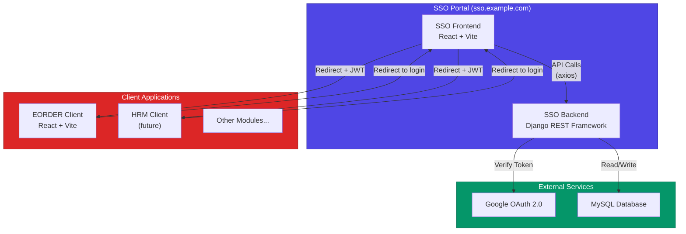
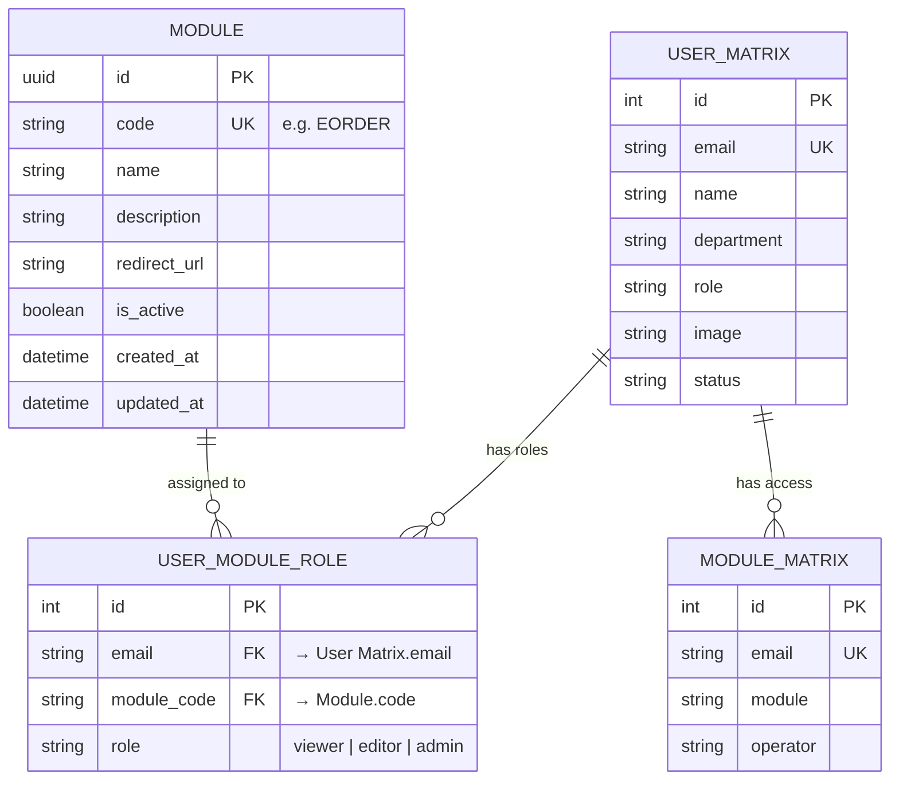
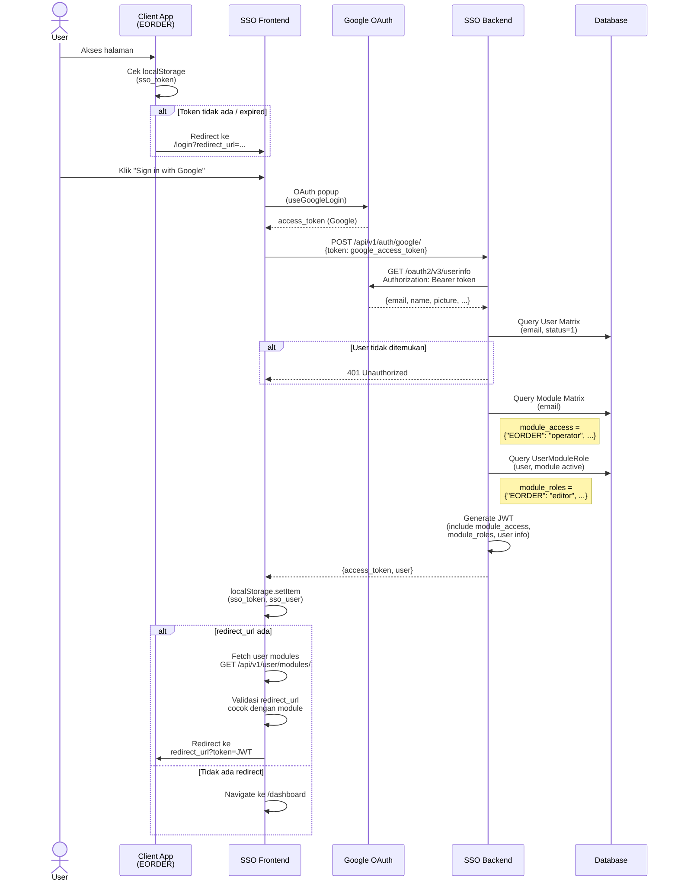
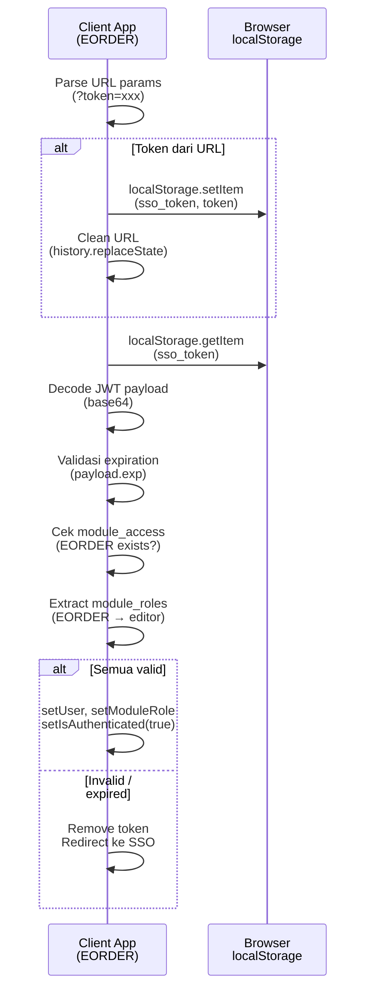
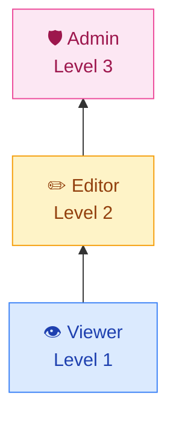
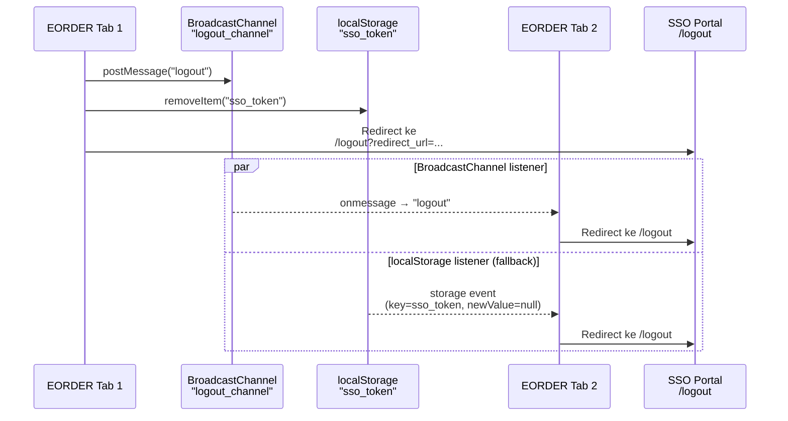
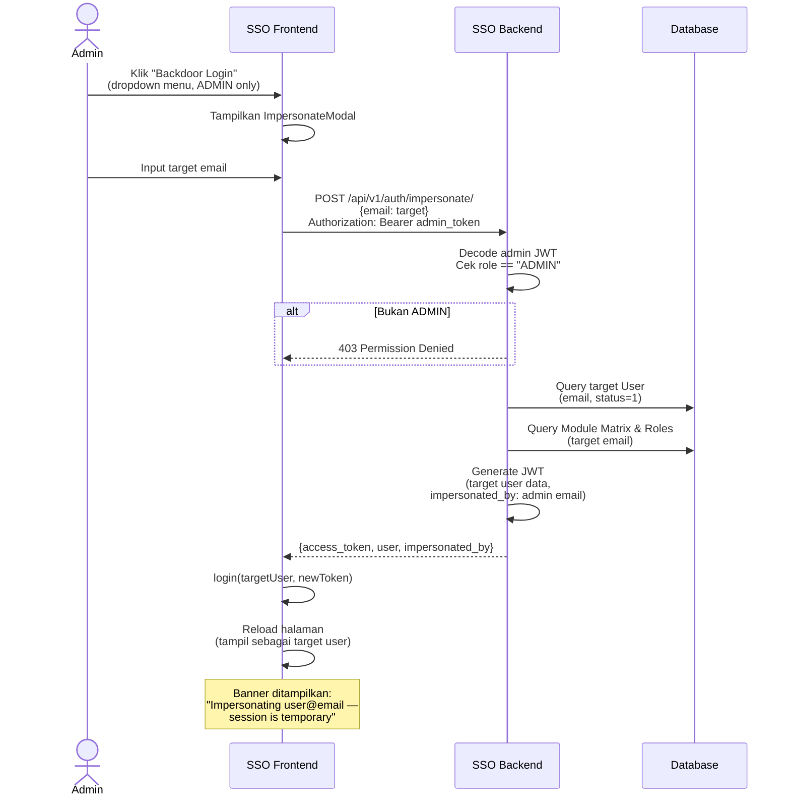
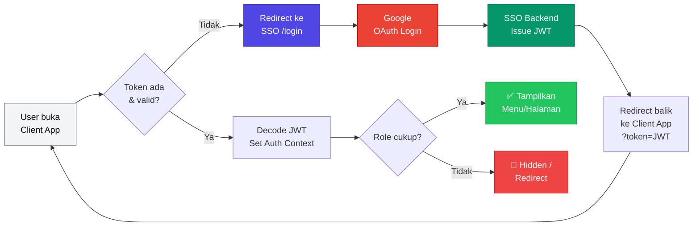

# Centralized SSO System

Sistem Single Sign-On (SSO) terpusat untuk mengelola autentikasi dan otorisasi pengguna di seluruh aplikasi internal (EORDER, HRM, dll). Dibangun dengan **Django REST Framework** (backend) dan **React + Vite** (frontend).

---

## Arsitektur Sistem



---

## Database Schema (ERD)



> **Note:** `User Matrix` dan `Module Matrix` adalah **external table** (`managed = False`) — Django tidak mengelola migrasinya.

---

## Authentication Flow

### 1. Login via Google OAuth 2.0



### 2. Client App Menerima Token



---

## JWT Payload Structure

```json
{
  "user_id": "123",
  "email": "user@company.com",
  "name": "John Doe",
  "department": "IT",
  "role": "USER",
  "image": "https://...",
  "module_access": {
    "EORDER": "PT XYZ",
    "HRM": "PT ABC"
  },
  "module_roles": {
    "EORDER": "editor",
    "HRM": "viewer"
  },
  "exp": 1718200000,
  "iat": 1718196400
}
```

| Field | Sumber | Keterangan |
|-------|--------|------------|
| `user_id`, `email`, `name`, `department`, `role`, `image` | `User Matrix` | Data profil user |
| `module_access` | `Module Matrix` | Module yang boleh diakses (key=module, value=operator) |
| `module_roles` | `UserModuleRole` | Role per module: `viewer`, `editor`, `admin` |
| `exp` | Config | Waktu expired (default: 60 menit) |
| `impersonated_by` | Impersonate API | (opsional) Email admin yang melakukan impersonasi |

---

## RBAC (Role-Based Access Control)

### Role Hierarchy



### Menu Access Matrix (EORDER)

| Menu Key | Min Role | Keterangan |
|----------|----------|------------|
| `order_dashboard` | `viewer` | Dashboard utama |
| `order_list` | `viewer` | Daftar order |
| `lpb_confirmation` | `viewer` | Konfirmasi LPB |
| `reports` | `viewer` | Laporan |
| `monitoring_upload` | `viewer` | Monitoring upload |
| `stt_upload` | `editor` | Upload file STT |
| `distribution_groups` | `admin` | Kelola grup distribusi |
| `settings` | `admin` | Pengaturan |

Pengecekan role menggunakan fungsi `hasMinRole()` dan `canAccessMenu()` di `AuthContext`:

```typescript
// User role "editor" → bisa akses menu dengan min role "viewer" dan "editor"
// User role "viewer" → TIDAK bisa akses menu dengan min role "editor" atau "admin"
const hasMinRole = (minRole: ModuleRole): boolean => {
  return (ROLE_LEVEL[moduleRole] ?? 0) >= ROLE_LEVEL[minRole];
};
```

---

## Logout & Cross-Tab Synchronization



### Mekanisme

| Mekanisme | Cara Kerja | Scope |
|-----------|-----------|-------|
| **BroadcastChannel** | Channel `logout_channel` — tab yang logout mengirim pesan, tab lain mendengarkan | Same-origin saja |
| **Storage Event** | Mendeteksi `sso_token` dihapus dari `localStorage` oleh tab lain | Same-origin (fallback) |

> **Catatan:** Kedua mekanisme hanya bekerja dalam **same-origin**. Logout dari SSO Portal ke Client App yang berbeda origin ditangani via redirect ke `/logout?redirect_url=...`.

---

## Admin Impersonation (Backdoor)



---

## API Endpoints

| Method | Endpoint | Auth | Keterangan |
|--------|----------|------|------------|
| `POST` | `/api/v1/auth/google/` | ❌ | Login via Google OAuth token |
| `POST` | `/api/v1/auth/impersonate/` | ✅ ADMIN | Generate JWT untuk user lain |
| `GET` | `/api/v1/user/modules/` | ✅ Bearer | Daftar module yang bisa diakses user |
| `GET` | `/api/v1/user/menu-access/` | ✅ Bearer | Role user per module (RBAC) |

---

## Frontend Routes

### SSO Portal

| Path | Component | Auth | Keterangan |
|------|-----------|------|------------|
| `/login` | `LoginPage` | ❌ | Halaman login (Google OAuth) |
| `/dashboard` | `SSOHomepageGrid` | ✅ | Daftar aplikasi yang bisa diakses |
| `/logout` | `Logout` | - | Hapus token, redirect ke login |

### Client App (EORDER)

| Path | Keterangan | Min Role |
|------|------------|----------|
| `/` | Dashboard | `viewer` |
| `/orders` | Order List | `viewer` |
| `/stt-upload` | Upload File STT | `editor` |
| `/distribution-groups` | Distribution Groups | `admin` |
| `/settings` | Settings | `admin` |

---

## Tech Stack

| Layer | Technology |
|-------|-----------|
| **SSO Frontend** | React 19, TypeScript, Vite, React Router, Axios, `@react-oauth/google` |
| **SSO Backend** | Django 5, Django REST Framework, PyJWT |
| **Database** | MySQL |
| **Authentication** | Google OAuth 2.0 + JWT |
| **Authorization** | RBAC (viewer / editor / admin per module) |

---

## Environment Variables

### SSO Backend (`sso_backend/.env`)

```env
JWT_SECRET=your-secret-key
JWT_ALGORITHM=HS256
ACCESS_TOKEN_LIFETIME=60
```

### SSO Frontend (`sso_frontend/.env`)

```env
VITE_GOOGLE_CLIENT_ID=your-google-client-id
VITE_API_BASE_URL=http://localhost:8000/api/v1
```

### Client App (`eorder-client/.env`)

```env
VITE_SSO_URL=http://localhost:5173
```

---

## Flow Ringkasan


