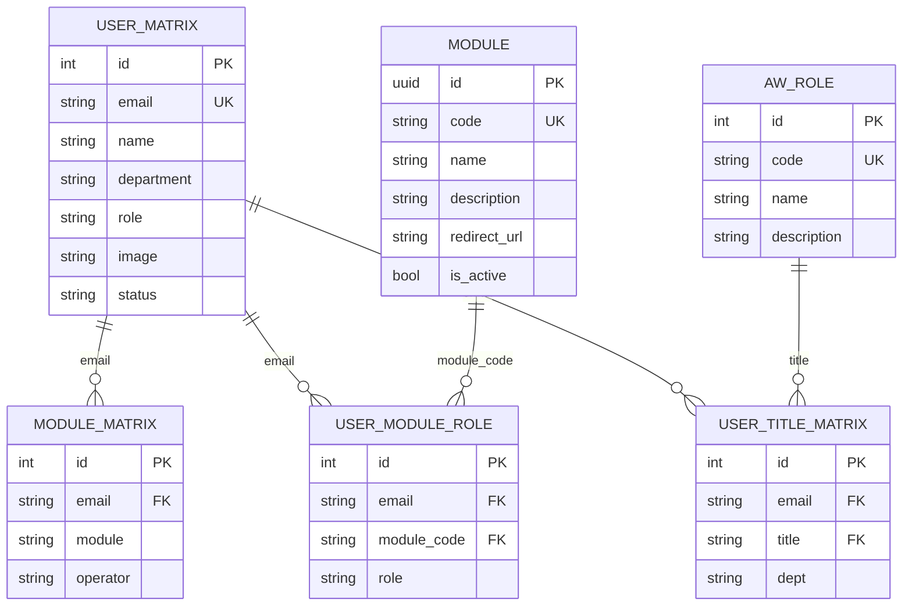
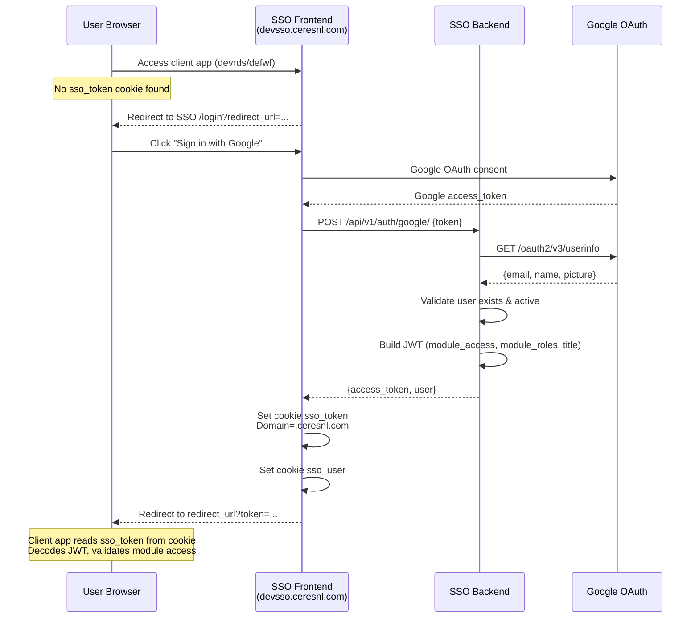
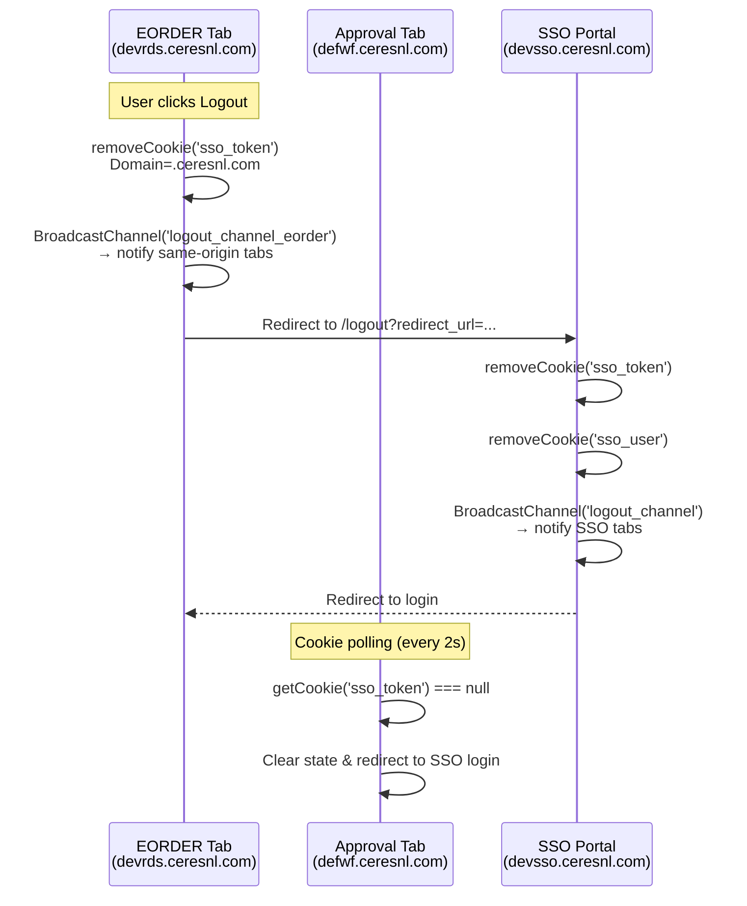

# SSO — Single Sign-On Platform

Centralized authentication & authorization system for all internal applications under the `*.ceresnl.com` domain.

## Table of Contents

- [Architecture Overview](#architecture-overview)
- [Tech Stack](#tech-stack)
- [Domain & Module Mapping](#domain--module-mapping)
- [Database Schema](#database-schema)
- [Authentication Flow — Login via Google](#authentication-flow--login-via-google)
- [Shared Cookie Strategy](#shared-cookie-strategy)
- [JWT Payload Structure](#jwt-payload-structure)
- [RBAC — Role-Based Access Control](#rbac--role-based-access-control)
- [Global Sign-Out](#global-sign-out)
- [API Endpoints](#api-endpoints)
- [Admin Impersonation](#admin-impersonation)
- [Environment Variables](#environment-variables)

---

## Architecture Overview

```
┌──────────────────────────────────────────────────────────────────┐
│                     *.ceresnl.com domain                         │
│                                                                  │
│  ┌────────────┐    ┌────────────────┐    ┌───────────────────┐  │
│  │  SSO App   │    │  EORDER Client │    │ Approval Client   │  │
│  │ devsso.*   │    │  devrds.*      │    │ defwf.*           │  │
│  └─────┬──────┘    └───────┬────────┘    └────────┬──────────┘  │
│        │                   │                      │              │
│        │       ┌───────────┴──────────────────────┘              │
│        │       │  Shared Cookie: sso_token                       │
│        │       │  Domain: .ceresnl.com                           │
│        │       └─────────────────────────────────                │
│  ┌─────┴──────┐    ┌──────────────┐    ┌─────────────────────┐  │
│  │ SSO Backend│    │ EORDER API   │    │ Approval Backend    │  │
│  │ Django     │    │ NestJS       │    │ Django              │  │
│  └────────────┘    └──────────────┘    └─────────────────────┘  │
└──────────────────────────────────────────────────────────────────┘
```

## Tech Stack

| Layer    | Technology                          |
|----------|-------------------------------------|
| Frontend | React + TypeScript + Vite           |
| Backend  | Django REST Framework               |
| Auth     | Google OAuth 2.0 + JWT              |
| Token    | Shared cookie (`sso_token`) on `.ceresnl.com` |
| Database | SQL Server (external, `managed=False` tables) + PostgreSQL (internal) |

## Domain & Module Mapping

| Sub-domain           | Module Code | Description             |
|----------------------|-------------|-------------------------|
| `devsso.ceresnl.com` | SSO         | SSO Portal (this app)   |
| `devrds.ceresnl.com` | EORDER      | E-Order Management      |
| `defwf.ceresnl.com`  | APPROVAL    | Centralized Approval    |

All sub-domains share the same parent domain `ceresnl.com`, enabling shared cookie authentication.

---

## Database Schema



**Key Tables:**

| Table | Managed | Description |
|-------|---------|-------------|
| `User Matrix` | ❌ External | Master user data (from iTAM) |
| `module` | ✅ Django | Registered application modules |
| `module_matrix` | ❌ External | User ↔ Module access mapping |
| `user_module_role` | ✅ Django | Per-module role assignment (viewer/editor/admin) |
| `user_title_matrix` | ❌ External | User ↔ Title/Role mapping for approval workflow |
| `aw_role` | ✅ Django | Approval role master data |

---

## Authentication Flow — Login via Google



**Step-by-step:**

1. User accesses a client app (e.g., `devrds.ceresnl.com`).
2. Client detects no `sso_token` cookie → redirects to SSO login page with `redirect_url`.
3. User clicks **"Sign in with Google"** → Google OAuth consent flow.
4. Google returns an `access_token` to the SSO frontend.
5. SSO frontend sends the token to `POST /api/v1/auth/google/`.
6. SSO backend validates the token with Google, looks up the user, builds a JWT with permissions.
7. SSO frontend saves JWT as `sso_token` cookie with `Domain=.ceresnl.com`.
8. SSO frontend redirects to the original `redirect_url`.
9. Client app reads `sso_token` from cookie, decodes JWT, and validates module access.

---

## Shared Cookie Strategy

All authentication state is managed via shared cookies on the `.ceresnl.com` domain:

| Cookie       | Content           | Domain          | Path | SameSite | Expiry |
|-------------|-------------------|-----------------|------|----------|--------|
| `sso_token` | JWT access token  | `.ceresnl.com`  | `/`  | Lax      | 1 day  |
| `sso_user`  | JSON user data    | `.ceresnl.com`  | `/`  | Lax      | 1 day  |

**How it works:**

```
devsso.ceresnl.com  ──┐
devrds.ceresnl.com  ──┤── All share cookie: sso_token (Domain=.ceresnl.com)
defwf.ceresnl.com   ──┘
```

- **SSO Frontend (writer):** Sets `sso_token` cookie after successful Google login.
- **Client apps (readers):** Read `sso_token` cookie via `document.cookie` and decode the JWT locally.
- **No localStorage dependency:** All token storage is cookie-based, enabling cross-subdomain access.

**Cookie helper functions** (used consistently across all apps):

```typescript
// Get cookie domain — .ceresnl.com for production, hostname for local
const getCookieDomain = () =>
  window.location.hostname.includes('ceresnl.com')
    ? '.ceresnl.com'
    : window.location.hostname;

// Read cookie by name
const getCookie = (name: string) => {
  const nameEQ = name + "=";
  const ca = document.cookie.split(';');
  for (let i = 0; i < ca.length; i++) {
    let c = ca[i];
    while (c.charAt(0) == ' ') c = c.substring(1, c.length);
    if (c.indexOf(nameEQ) == 0)
      return decodeURIComponent(c.substring(nameEQ.length, c.length));
  }
  return null;
};

// Remove cookie (expire it)
const removeCookie = (name: string) => {
  const domain = getCookieDomain();
  document.cookie = name + "=;expires=Thu, 01 Jan 1970 00:00:00 GMT;domain=" + domain + ";path=/";
};
```

---

## JWT Payload Structure

The JWT issued by SSO backend contains:

```json
{
  "user_id": "uuid",
  "email": "user@ceresnl.com",
  "name": "John Doe",
  "department": "IT",
  "role": "ADMIN",
  "image": "https://...",
  "title": "MANAGER",
  "module_access": {
    "EORDER": "PL-PLANT",
    "APPROVAL": "APPROVAL"
  },
  "module_roles": {
    "EORDER": "editor",
    "APPROVAL": "admin"
  },
  "exp": 1718812800,
  "iat": 1718726400
}
```

| Field           | Description                                       |
|----------------|---------------------------------------------------|
| `user_id`      | UUID dari tabel User Matrix                        |
| `email`        | Email pengguna (unique)                            |
| `module_access`| Mapping module → operator dari `module_matrix`     |
| `module_roles` | Mapping module → role dari `user_module_role`      |
| `title`        | Title/jabatan dari `user_title_matrix`             |
| `exp`          | Expiration time (configurable, default 60 menit)   |

**Client-side validation:**

Each client app decodes the JWT and checks:
1. Token not expired (`exp > now`)
2. Module access exists (e.g., `module_access['EORDER']` for EORDER app)
3. Module role level (e.g., `module_roles['EORDER']` = `editor`)

---

## RBAC — Role-Based Access Control

### Role Hierarchy

```
viewer (level 1)  →  editor (level 2)  →  admin (level 3)
```

| Role     | Level | Permissions |
|----------|-------|-------------|
| `viewer` | 1     | Read-only access |
| `editor` | 2     | Read + Write access |
| `admin`  | 3     | Full access + settings |

### Per-Module Role Assignment

Setiap user memiliki role berbeda per module, dikonfigurasi di tabel `user_module_role`:

```
User: user@ceresnl.com
├── EORDER   → editor
├── APPROVAL → admin
└── HRM      → viewer
```

### Menu Access Control (Client-side)

Contoh pada EORDER client:

```typescript
const MENU_MIN_ROLE: Record<string, ModuleRole> = {
  order_dashboard:  'viewer',
  order_list:       'viewer',
  stt_upload:       'editor',
  settings:         'admin',
};

// Check: user.moduleRole >= menu.minRole
const canAccessMenu = (menuKey: string) => {
  const minRole = MENU_MIN_ROLE[menuKey];
  return ROLE_LEVEL[userRole] >= ROLE_LEVEL[minRole];
};
```

---

## Global Sign-Out

Global sign-out memastikan ketika user logout dari **satu aplikasi manapun**, semua tab dan sub-domain lainnya ikut ter-logout secara otomatis.

### Mekanisme



### 3 Layers of Logout Detection

| Layer | Scope | Mechanism | Speed |
|-------|-------|-----------|-------|
| **1. BroadcastChannel** | Same-origin tabs | `BroadcastChannel('logout_channel_*')` | Instant |
| **2. Shared Cookie Removal** | Cross-subdomain | `removeCookie('sso_token')` with `Domain=.ceresnl.com` | Instant on next read |
| **3. Cookie Polling** | Cross-subdomain tabs | `setInterval` cek `getCookie('sso_token')` tiap 2 detik | ≤ 2 seconds |

### Flow Detail

**Layer 1 — BroadcastChannel (same-origin, instant):**

```typescript
// Saat user logout dari EORDER tab 1
const logoutChannel = new BroadcastChannel('logout_channel_eorder');
logoutChannel.postMessage('logout');

// EORDER tab 2 langsung menerima & logout
logoutChannel.onmessage = (event) => {
  if (event.data === 'logout') performLogout();
};
```

> ⚠️ BroadcastChannel hanya bekerja antar tab dengan **origin yang sama**. Tidak bisa notify lintas sub-domain.

**Layer 2 — Shared Cookie Removal (cross-subdomain):**

```typescript
// removeCookie menghapus cookie dengan Domain=.ceresnl.com
// Efeknya: cookie hilang di SEMUA sub-domain sekaligus
removeCookie('sso_token');
// → Cookie deleted di devrds, defwf, devsso
```

**Layer 3 — Cookie Polling (cross-subdomain detection):**

```typescript
// Setiap client app polling cookie tiap 2 detik
useEffect(() => {
  if (!isAuthenticated) return;
  const interval = setInterval(() => {
    const token = getCookie('sso_token');
    if (!token) {
      // Cookie sudah dihapus oleh app lain
      setIsAuthenticated(false);
      window.location.href = SSO_LOGIN_URL;
    }
  }, 2000);
  return () => clearInterval(interval);
}, [isAuthenticated]);
```

### Logout dari SSO Portal

```typescript
// SSO AuthContext logout()
const logout = () => {
  removeCookie('sso_token');   // Hapus token di .ceresnl.com
  removeCookie('sso_user');    // Hapus user data

  // Notify SSO tabs via BroadcastChannel
  const logoutChannel = new BroadcastChannel('logout_channel');
  logoutChannel.postMessage('logout');
  logoutChannel.close();

  // Redirect (optional redirect_url for client apps)
  window.location.href = redirectUrl || '/login';
};
```

**Hasil:** Saat cookie `sso_token` dihapus dari SSO, semua client app (`devrds`, `defwf`) yang sedang melakukan polling akan mendeteksi `sso_token === null` dalam waktu ≤ 2 detik dan otomatis redirect ke halaman login SSO.

---

## API Endpoints

Base URL: `/api/v1`

| Method | Path                   | Auth | Description                        |
|--------|------------------------|------|------------------------------------|
| POST   | `/auth/google/`        | ❌   | Google OAuth login, returns JWT    |
| POST   | `/auth/impersonate/`   | ✅ ADMIN | Generate JWT for another user  |
| GET    | `/user/modules/`       | ✅   | List modules user has access to    |
| GET    | `/user/menu-access/`   | ✅   | Get user's per-module roles        |

### POST `/auth/google/`

**Request:**
```json
{ "token": "<google_access_token>" }
```

**Response:**
```json
{
  "access_token": "<jwt_token>",
  "user": {
    "id": 123,
    "email": "user@ceresnl.com",
    "name": "John Doe",
    "department": "IT",
    "role": "ADMIN",
    "image": "https://..."
  }
}
```

### GET `/user/modules/`

**Headers:** `Authorization: Bearer <jwt>`

**Response:**
```json
{
  "modules": [
    {
      "module": "EORDER",
      "operator": "PL-PLANT",
      "name": "E-Order Management",
      "description": "...",
      "redirect_url": "https://devrds.ceresnl.com",
      "role": "editor"
    }
  ]
}
```

### GET `/user/menu-access/`

**Headers:** `Authorization: Bearer <jwt>`

**Response:**
```json
{
  "EORDER": "editor",
  "APPROVAL": "admin"
}
```

---

## Admin Impersonation

Admin users (`role = 'ADMIN'`) can impersonate other users via the **Backdoor Login** feature on the SSO dashboard.

### Flow

1. Admin clicks **Backdoor Login** from the user dropdown menu.
2. Enters the target user's email.
3. Backend validates admin role, builds a new JWT for the target user.
4. Frontend stores the new token and reloads.

### POST `/auth/impersonate/`

**Headers:** `Authorization: Bearer <admin_jwt>`

**Request:**
```json
{ "email": "target@ceresnl.com" }
```

**Response:**
```json
{
  "access_token": "<impersonated_jwt>",
  "user": { "id": "...", "email": "target@ceresnl.com", "name": "..." },
  "impersonated_by": "admin@ceresnl.com"
}
```

> The impersonated JWT contains an extra `impersonated_by` field for audit trail.

---

## Environment Variables

### Backend (`sso_backend/.env`)

| Variable                | Description                    | Example                    |
|------------------------|--------------------------------|----------------------------|
| `JWT_SECRET`           | Secret key for JWT signing     | `your-secret-key`          |
| `JWT_ALGORITHM`        | JWT algorithm                  | `HS256`                    |
| `ACCESS_TOKEN_LIFETIME`| Token expiry in minutes        | `60`                       |
| `GOOGLE_CLIENT_ID`     | Google OAuth client ID         | `xxx.apps.googleusercontent.com` |

### Frontend (`sso_frontend/.env`)

| Variable                | Description                    | Example                          |
|------------------------|--------------------------------|----------------------------------|
| `VITE_GOOGLE_CLIENT_ID`| Google OAuth client ID         | `xxx.apps.googleusercontent.com` |
| `VITE_SSO_URL`         | SSO frontend base URL          | `https://devsso.ceresnl.com`     |
| `VITE_API_URL`         | SSO backend base URL           | `http://localhost:8000/api/v1`   |

### Client Apps (EORDER / Approval)

| Variable                  | Description                 | Example                          |
|--------------------------|-----------------------------|----------------------------------|
| `VITE_SSO_URL`           | SSO frontend URL for redirects | `https://devsso.ceresnl.com`  |
| `VITE_SSO_BACKEND_URL`   | SSO backend URL for API calls  | `https://devsso-api.ceresnl.com/api/v1` |
| `VITE_API_URL`           | Own backend API URL            | `https://devrds-api.ceresnl.com` |
